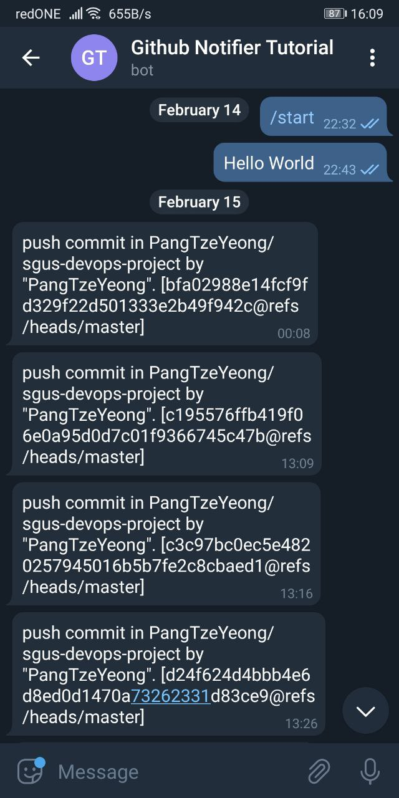
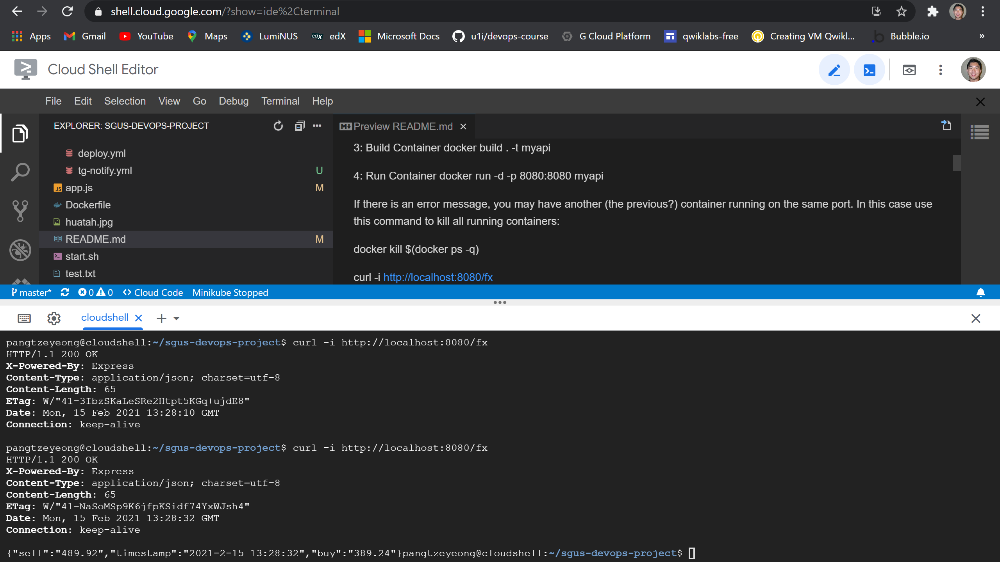

<h1 align="center"> *(Forked Repo)* # Currency Exchange API – NodeJS </h1>

## Adding a Github Telegram notifier

Set up GitHub Actions workflow that triggers telegram notification whenever there is a Push/Pull request

* GitHub actions provides a workflow for user to automate certain process when certain actions are triggered

* In .github/workflows/ we can find ***tg-notify.yml*** created to enable such telegram notifications

* https://cyaninfinite.com/getting-updates-from-github-via-telegram-bot/

 telegram username @gh_notify8888_bot => Note: a unique access ChatToken is inserted in 'Settings=>Secrets', which tells the telegram bot to notify only my particular chat_id when there is a trigger 

## Steps in Google Cloud Shell with Editor

https://shell.cloud.google.com/

***1) Get Source***

 git clone https://github.com/PangTzeYeong/devops-project 

***2) Make changes (optional)***

 modify app.js in directory 

***3) Build Container***

 docker build . -t myapi 

***4) Run Container***

 docker run -d -p 8080:8080 myapi 

If there is an error message, there may be another container running on the same port. In this case use following command to kill all running containers:

 docker kill $(docker ps -q) 

curl -i http://localhost:8080/fx

Screenshot of the output for the command above

## Optional: what's next

***Improve Telegram bot***

 So that the bot can notify multiple people when there are updates to specific parts of the repository 

***Publish to Dockerhub***

 Shall sign up at https://hub.docker.com/ and get more familiar with it.. After 15days of Chinese New Year celebrations =) HUAT AH ! 

